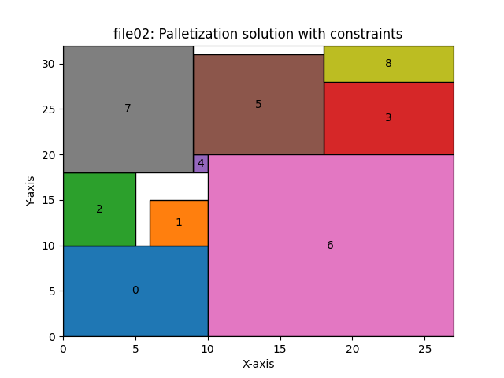

# Palletizing with adjacency constrain

The objective is to implement an optimization model for the palletizing problem extended by **constraints**. The constraints should have a form of two lists:

1. a list of pairs of element which have to be adjacent in the arrangement
2. a list of pairs of element which cannot be adjacent in the arrangement

The **_benchmarks/data_** directory contains the files with the data for the problem. The data files are in the format:

```
3   5
1   4
2   6
4   7
10  5
3   6

0   1
5   4
3   2

1   2
```

- The first section contains the dimensions of each element. The first number is the width and the second is the height.
- The second section contains the index of pairs of elements which have to be adjacent.
- The third section contains the index pairs of elements which cannot be adjacent.

Thus, the dimensions of elements will be:
**[(3, 5), (1, 4), (2, 6), (4, 7), (10, 5), (3, 6)]**

the adjacency elements will be:
**[(0, 1), (5, 4), (3, 2)]**

and the non-adjacency elements will be:
**[(1, 2)]**

**Note**: the adjacency and non-adjacency elements are indexed from 0, where 0 is the first element in the list and so on.

## Solution

It is possible to solve this problem in two ways:

1. The basic one, without constraints
2. The extended one, with constraints

The solutions are stores in the **_benchmarks/_** directory and inside the folder with the same name as the file used to run the program. Inside this folder, two directories are created, one for the solution without constraints and the other for the solution with constraints. Each directory contains two files:

- The first one contains the position of each element in the arrangement, the area of the arrangement, the max values of **X** and **Y** coordinates, the **area** and the **occupation rate**.
- The second one is an image of the arrangement.
  </br>
  
  </br>

Inside the directory with the same name as the file used to run the program, there is an image that shows the optimization progress over time for the solution **with** and **without** constraints.
</br>


## How to run the program

It is possible to run the program with a file created by your own, you just have to put the correct path, to the file, like in the command below:

```bash
python3 palletizationWithConstraints.py -f benchmarks/data/file01.txt
```

If you don't want to create your own file, you can use one of the files in the **_benchmarks/data_** directory. The command above will run the program with the file **_file01.txt_**.

# Author

Work done by [João Farias](https://www.linkedin.com/in/jo%C3%A3o-farias-7a7b48266/)
</br>
Politechnika Rzeszowska, June 2023.
